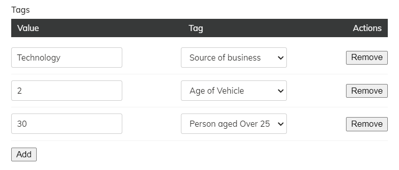

# Tag/Value Custom Field
This custom field allows you to add dynamic fields (and their values) to any piece of content in Agility CMS. 

This makes it easy to build flexible content models where each item could have varying sets of fields.

**Features**:
- Dynamically add as many tags/fields as you'd like to a content item
- Saves content as `JSON`
- Uses a secure iFrame embed 
- Built using `React`


## Overview
### [🎥 Watch Video](https://github.com/agility/CustomFields/blob/master/tag-value-field/media/tag-value-field.mp4?raw=true)


## Field 
Renders a grid that allows editors to add as many fields (and their values) as they want.



## Example
We have an example [React implementation](react-field) of this field you can use. 

## Requirements
In order to use this custom field, some **setup** is required.

1. [Administrator access to an Agility CMS instance](#retrieve-your-agility-cms-preview-api-key) so you can retrive your preview API Key
2. [Initialize a list of tag/field options that editors can use](#initialize-a-list-of-tag-field-options)
3. [Install the integration](#install-the-integration)
4. [Create a Content Model that uses the Custom Field](#create-a-content-model-that-uses-the-custom-field)


## Retrieve your Agility CMS Preview API Key
You'll need an API key so that your custom field can authenticate with the Content Fetch API to retrieve the list of available tags/fields to set.
1. Login to [Agility CMS](https://manager.agilitycms.com/)
2. Locate and copy the **preview** `API Key` value from  [Settings > API Keys](https://manager.agilitycms.com/settings/apikeys)

## Initialize a list of Tag/Field options
Create a new Content Model in Agility which will hold all the available options an editor can interact with in the custom field. This enables your editors to also have full control over those options.
1. Go to **Models** > **Content Models** in Agility CMS.
2. Create a new **Content Model** that has a **Title** (text) field.
3. Initialize a list of content based on that Model and give it a name (i.e. `Tags`).
4. Navigate to that list and create several content items within it.
5. Click on the **Settings** tab of the content list to retrieve the `Reference Name` for the list - you'll need this later to configure your custom field to use that list to display options.

## Install the Integration
In order to use the custom field, you'll need to register it in your custom scripts file that is connected to your Agility CMS instance (via UI Extensions).

Login to your Agility CMS instance and navigate to [UI Extensions](https://manager.agilitycms.com/settings/uiextensions).

You may or may not already have a `Custom Fields Script URL`  defined. 

If you have an existing `JavaScript` file defined, then you'll want to append the following contents of the [`register-tag-value-field.js`](react-field/public/register-tag-value-field.js) to that file:

```javascript
/**
 * THIS FILE IS USED FOR THE AGILITY'S CUSTOM FIELDS
 */

var TagValueCustomField = function() {

    var self = this;
    self.Label = "Tag Value Custom Field";
    self.ReferenceName = "TagValueCustomField";
    self.Render = function (options) {
        setupIframe({
            fieldLabel: self.Label,
            fieldReferenceName: self.ReferenceName,
            fieldOptions: options,
            //the absolute URL to your custom fields app
            iFrameUrl: 'https://agility-tag-value-custom-field-example.vercel.app/',
            iFrameWidth: '100%',
            iFrameHeight: 'auto',
            iFrameClassName: 'tag-value-custom-field',
            customProps: {
                //the reference name of the content list in Agility you want to pull as options for the tags
                tagsContentReferenceName: 'Tags',
                //your preview API key that will be used to retrieve content from Agility (https://manager.agilitycms.com/settings/apikeys)
                apiKey: 'defaultpreview.7dc1052104d1f593efd8f7934e913f70e5f7615a6e80970b5f18f4ebe6a0810c'
            }
        })
    }
}

ContentManager.Global.CustomInputFormFields.push(new TagValueCustomField());

var setupIframe = function(params) {

    var $pnl = $("." + params.iFrameClassName, params.fieldOptions.$elem);

    if ($pnl.size() > 0) return; //already rendered...

    var iFrameOrigin = function() {
        var pathArray = params.iFrameUrl.split('/');
        var protocol = pathArray[0];
        var host = pathArray[2];
        var origin = protocol + '//' + host;
        return origin
    }();

    var config = ContentManager.ViewModels.Navigation.globalConfig();
    var languageCode = ContentManager.ViewModels.Navigation.currentLanguageCode();
    var fieldName = params.fieldOptions.fieldSetting.FieldName;
    var fieldID = params.fieldOptions.fieldSetting.FieldID;

    //set up the child iframe to render the field
    var iframe = document.createElement('iframe');
    iframe.className = params.iFrameClassName;
    iframe.width = params.iFrameWidth;
    iframe.height = params.iFrameHeight;
    iframe.src = params.iFrameUrl + '?fieldName=' + fieldName + '&fieldID=' + fieldID;
    iframe.onload = function() {}

    //render the iframe
    params.fieldOptions.$elem.html(iframe);

    //listen for all iframe messages
    window.addEventListener("message", function (e) {
        
        //only process messages from the child iframe
        if(e.origin !== iFrameOrigin) return;
        
        switch (e.data.type) {
            case 'fieldReady_for_' + fieldName + '_' + fieldID:
                console.log(fieldName + '['+ params.fieldOptions.fieldSetting.Settings.CustomFieldType + '] (from CMS) => Sending auth and fieldValue message');
                //send a message to the child iframe with the details of this field
                iframe.contentWindow.postMessage({
                    message: {
                        auth: {
                            guid: config.Guid,
                            websiteName: config.WebsiteName,
                            securityKey: config.SecurityKey,
                            languageCode: languageCode,
                            //'USA' or 'CANADA',
                            location: 'USA'
                        },
                        fieldValue: ko.unwrap(params.fieldOptions.fieldBinding),
                        fieldLabel: params.fieldOptions.fieldSetting.Label,
                        fieldName: fieldName,
                        fieldID: fieldID,
                        fieldReferenceName: params.fieldOptions.fieldSetting.Settings.CustomFieldType,
                        origin: window.location.href,
                        customProps: params.customProps
                    },
                    type: 'setInitialProps_for_' + fieldName + '_' + fieldID
                }, "*")

                break
            case 'setNewValue_for_' + fieldName + '_' + fieldID:
                params.fieldOptions.fieldBinding(e.data.message);
                break;
            case 'setHeight_for_' + fieldName + '_' + fieldID:
                iframe.height = e.data.message + "px"
                break;

            default:
                //do nothing...
                break;
        }

    }, false);
    
}
```

There are several properties you'll want to update that are specific to you, they are found in the `setupIframe` parameters:
```javascript
setupIframe({
            ...
            //the absolute URL to your custom fields app (can be http://localhost:3000 for local testing)
            iFrameUrl: 'https://agility-tag-value-custom-field-example.vercel.app/',
            ...
            customProps: {
                //the reference name of the content list in Agility you want to pull as options for the tags
                tagsContentReferenceName: 'Tags',
                //your preview API key that will be used to retrieve content from Agility (https://manager.agilitycms.com/settings/apikeys)
                apiKey: 'defaultpreview.7dc1052104d1f593XXXXXXXXXXXXXXXXXXXXXXX'
            }
        })
```

## Create a Content Model that uses the Custom Field
Now that you've configured your content and the installed the integration, the next step is to actually use the field on a Content or Page Module.

1. Go to **Models** > **Content Models** and click **+ Add** to create a new Content Model.
2. Click **Add Field**, give it a name, and then select **Custom Field** as the field type.
3. Under the **Custom Field Type** dropdown, select the **Tag Value Custom Field** and click **Add Field** to add the field to your Content Model.

Now that you are using the field within a model, you can then initialize content based on that model and the field will be rendered in the input form.

